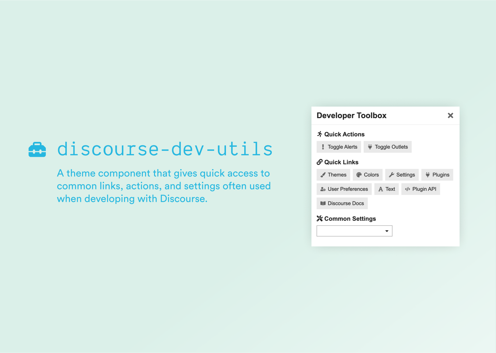

# Developer Toolbox

## How it Works

Press <kbd>`</kbd> on your keyboard to launch the Developer Toolbox, or enable a physical button in the UI by toggling the theme setting <code>show_header_button</code>